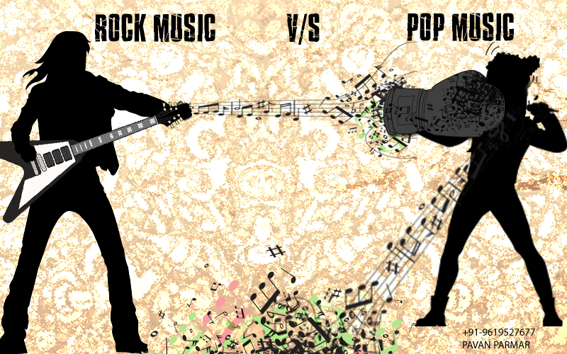

# Applied Data Science @ Columbia
## Spring 2020
## Project 1: A "data story" on the songs of our times



### [Project Description](doc/)
This is the first and only *individual* (as opposed to *team*) this semester. 

Term: Spring 2020

+ Projec title: Different influence from Rock n Roll and Hip-Hop
+ This project is conducted by Rui Wang

+ Project summary: By analyzing the lyrics for Rock and Hip-Hop, we could get the following results.

 + Lyrics for Rock music conveys healthier information which talks about life with positive trustful words.

 + Lyrics for Hip-Hop music conveys kind of unhealthier information with negtive fearful words.


Following [suggestions](http://nicercode.github.io/blog/2013-04-05-projects/) by [RICH FITZJOHN](http://nicercode.github.io/about/#Team) (@richfitz). This folder is orgarnized as follows.

```
proj/
├── lib/
├── data/
├── doc/
├── figs/
└── output/
```

Please see each subfolder for a README file.
